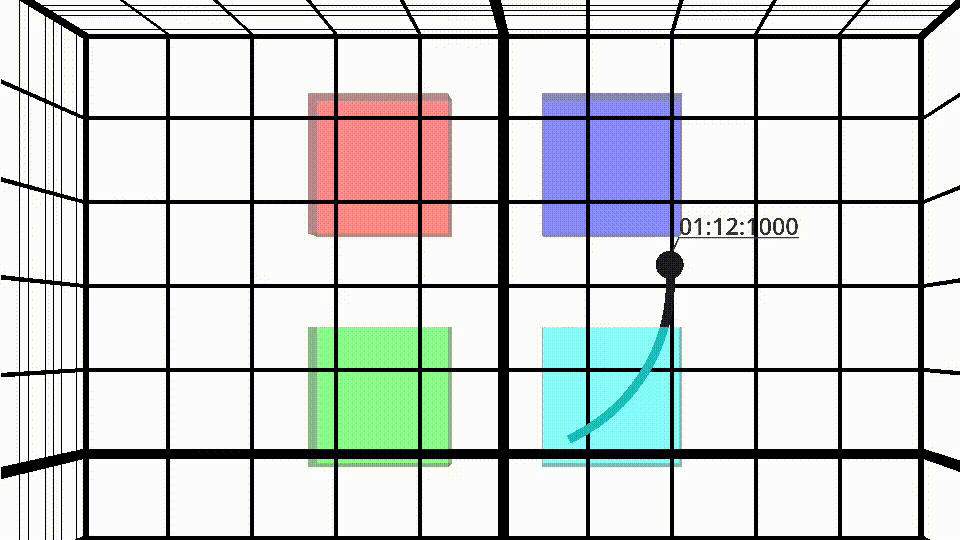

# CUWB Viewer Passthrough


The cuwb-viewer passthrough geofencer extension allows users to visualize configured zones directly within the [CUWB Viewer](https://www.cuwb.io/docs/latest/software/cuwb-viewer/). Users can assign colors to zones defined in the configuration file, and those zones will appear in the CUWB Viewer with those colors. Tags that enter a zone will also automatically inherit the color assigned to that zone, making zone occupancy easy to identify visually.

>Rendering of geofencer zones is only supported in CUWB Viewer version **2.1.4** or newer, so make sure you're CUWB Viewer installation is updated before running this extension.

## Usage
All geofencer dependencies must be installed before running this extension. Follow the instructions in the geofencer README to set up a python virtual environment and install the packages.

Before launching the extension, ensure the CUWB Viewer is running and is configured to listen on the same UDP settings specified for the extension’s output stream. Otherwise, the CUWB Viewer will not receive the zone information transmitted by the extension and will be unable to render the configured zones.

The cuwb-viewer passthrough is run with the following command:
```
python cuwb_viewer_passthrough.py <config file>
```

## Config File
Like the geofencer application itself, the cuwb-viewer passthrough extension accepts its arguments through a YAML configuration file. The extension also validates the configuration file against the schema file at startup. An example configuration file is provided and can be used as a starting point for creating a custom configuration.

### Ethernet
#### Input
The cuwb-viewer passthrough listens for Geofencer Zone Info and Tag Zone Info CDP data items generated by the main geofencer application. Therefore, the input stream configuration must match the output settings in the  geofencer configuration file.

#### Output
The cuwb-viewer passthrough extension will transmit its own CDP data items on the configured output stream. As previously noted, the CUWB Viewer application should be configured to listen on this same output stream so it can receive the zone information and tag color data items.

Providing this setting is optional. If omitted, the input stream will be used as the output stream by default.

### Zones
This list of zones is formatted similarly to the geofencer configuration file. However, instead of providing vertices, z range, and hysteresis, each zone only requires a `Color` argument. For this extension, `Color` is defined as an RGB value consisting of a list of 3 integers, each ranging from 0 to 255.

In the CUWB Viewer, each zone is rendered using its specified `Color`, and any tag entering that zone is also displayed using the same color. Zones will appear slightly translucent in the CUWB Viewer to increase visibility of tags that are inside of it.

>Although it's not a part of the configuration file, zone translucency can be easily modified. To modify it, locate the `ZONE_COLOR_ALPHA_VALUE` constant definition in `cuwb_viewer_passthrough.py` and update its value. The default is 128; it can be set to any number from 0 to 255 (0 = fully transparent, 255 = opaque). Note that this value applies to all zones globally.

### Default Color
Tags that are not located within any zone will be displayed in the CUWB Viewer using this color.

Providing this argument is optional. If omitted, tags will have their custom color removed in the CUWB Viewer and will go back to their default CUWB Viewer color (typically blue).

### Print Output
Setting this argument to `False` disables terminal output from the process.

Providing an argument is optional. By default, terminal printing is enabled.

## Output
When this program runs, it first builds a mapping of zone ID's to zone names based on the zones defined in its configuration file.  To do this, it begins listening for Geofencer Zone Info data items which contain the zone ID's. Depending on the `Output Interval` setting in the geofencer configuration, this may take a few seconds.

While collecting zone information, if the program receives a Geofencer Zone Info data item for any zone that is not defined in its configuration file, it will still send that data to the CUWB Viewer to render that zone, but it will be displayed in gray.

After the mapping is completed, the program prints "All zone info received."  At that point, the program sends the complete zone information to the CUWB Viewer for rendering and begins processing Tag Zone Info data items to determine which color the tag should be assigned.

If a tag is located in multiple overlapping zones, the color is assigned to that tag by the order in which zones appear in the input configuration file.  For example, with the following configuration file:
```
Zones:
  Zone A:
    Color: [255, 0, 0] # red
  Zone B:
    Color: [0, 0, 255] # blue
```
If a tag is in both Zone A and Zone B at the same time, then it will be assigned the color red since Zone A appears before Zone B in the configuration file.

## Note on Program Halt
If you stop this program using the standard Ctrl+C command, it will send commands to the CUWB Viewer to remove all zones and remove all custom colors from the devices. This provides a convenient way to reset the CUWB Viewer scene to the state it was in before starting the cuwb-viewer passthrough extension.

## Note on Existing CUWB Viewer Objects
Geofencer zones will overwrite any existing CUWB Viewer imported objects with the same name.  If your CUWB Viewer environment contains an imported object named “Box” and you run the CUWB Viewer Passthrough script with a zone that is also named "Box", the existing "Box" object in the CUWB Viewer will be deleted and replaced by the "Box" zone.
